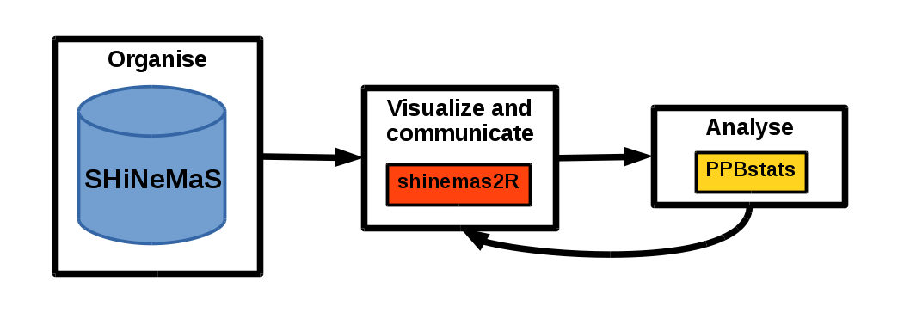

## What is `PPB` ?

`PPB` is an R package that provides severals examples of workflow of analysis that can be used in PPB programmes.

`PPB` is based on the use of

- the data base [SHiNeMaS](http://moulon.inra.fr/index.php/en/tranverse-team/atelier-de-bioinformatique/projects/181)
- the two `R` packages
    + [`shinemas2R`](https://github.com/priviere/shinemas2R)
    + [`PPBstats`](https://github.com/priviere/PPBstats)

The workflow of analysis can be describe as follow:

